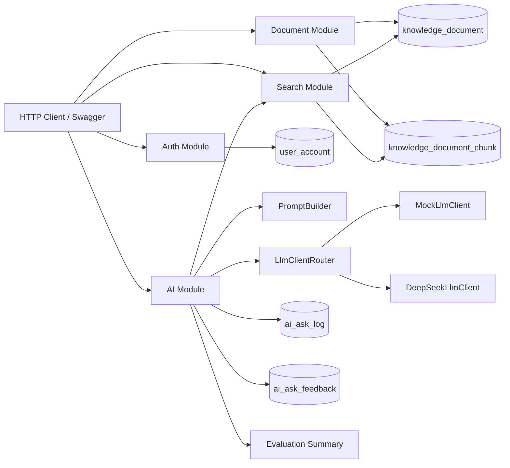
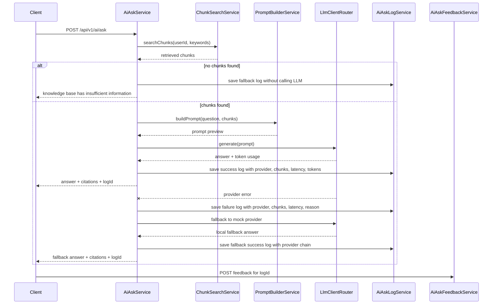

# DevMind 后端

DevMind 是一个个人开发者知识库的 Spring Boot 后端，内置 RAG 式的 AI 问答链路。

项目包含认证、文档管理、chunk 生成、检索、Prompt 构造、LLM Provider 抽象、引用来源、AI 调用日志、token 用量统计、bad case 反馈，以及一套轻量的 RAG 评估接口。

## 为什么做这个项目

很多 AI demo 止步于“把 prompt 发给模型、拿回一个答案”。DevMind 把 AI 问答当成一个正常后端系统的一部分来做：

```text
knowledge document
-> text or Markdown file import
-> document chunks
-> retrieval
-> no-context fallback when retrieval is empty
-> prompt building
-> LLM provider
-> provider fallback when the real model fails
-> answer with citations
-> success/failure ask log with token usage
-> bad-case feedback
-> evaluation summary
```

AI 功能被接进了后端工程里常见的关注点：认证、数据库设计、服务分层、可观测性、成本追踪，以及可迭代的质量改进。

## 核心功能

- JWT 认证 + BCrypt 密码加密
- 基于 Redis 的 JWT 登出黑名单
- 按用户隔离的知识文档
- 软归档而非物理删除
- TXT / Markdown 笔记导入并自动建文档
- 文档 chunk 自动生成，更新时自动重建
- 面向中英文技术问题的多语言关键词检索
- `RetrievalStrategy` / `EmbeddingClient` / `RerankClient` 抽象，覆盖关键词 baseline、混合检索、dense embedding 与 rerank
- 基于 MySQL FULLTEXT 的 chunk 内容相关性检索
- chunk 向量持久化（默认本地稀疏向量，可选经 OpenAI 兼容 API 的真实 dense embedding），与关键词排名用 RRF 融合，并可叠加 rerank；默认配置零外部调用
- 元数据感知检索：chunk 内容、文档标题、标签、来源类型
- 重复 chunk 降权，减少复制粘贴笔记造成的重复引用
- 无上下文兜底，避免模型在无依据时强答
- 带 Prompt Preview 和引用来源的 RAG 问答链路
- 可插拔的 LLM 层：`MockLlmClient` 与 `DeepSeekLlmClient`
- 通过环境变量接入 DeepSeek 真实模型
- 真实模型调用失败时，从配置的模型降级回本地 mock
- AI 调用日志：成功/失败状态、provider、耗时、召回 chunk id、token 用量
- AI 反馈记录：helpful 标注与 bad case 收集
- 评估汇总接口：总反馈数、bad case 数、bad case 率、近期 bad case
- RAG 评估数据集接口：标准问题、期望答案、期望关键词、问答日志覆盖情况
- 检索评估指标：Hit@3、MRR、首个相关片段排名、无上下文负例
- OpenAPI / Swagger UI 与 IDEA HTTP Client 示例

## 技术栈

```text
Java 17
Spring Boot 3.3.x
Spring Security
MyBatis-Plus
MySQL
Redis
Maven
Flyway
Springdoc OpenAPI
JJWT
DeepSeek API
```

## 测试与 CI

用 Maven Wrapper 在本地跑后端测试（无需系统安装 Maven）：

```bash
./mvnw test        # Windows: .\mvnw.cmd test
```

现有测试覆盖了在后续迭代中应保持稳定的核心逻辑：

```text
Prompt building
Mock LLM responses
LLM provider routing
JWT creation and parsing
Redis-backed token blacklist
Spring context wiring for mapper scan safety
```

测试集还包含一个受 Docker 控制的 MySQL Testcontainers 集成测试。当 Docker 可用时，它会启动 MySQL 5.7、在真实数据库引擎上执行 Flyway 迁移、经服务层创建一篇文档、验证 chunk 向量持久化、跑一遍混合检索，并检查 MySQL FULLTEXT mapper 的行为。当本地没有 Docker 时，该集成测试会被跳过，而不是阻塞本地开发。

GitHub Actions 会在每次向 `main` 的 push 和 pull request 上执行同样的 Maven 测试命令，因此 MySQL 集成测试预期会在有 Docker 的 CI 环境里真实运行。

## 架构



更多细节见：[架构说明](docs/architecture.md)

## RAG 流程



## 接口总览

Swagger UI：

```text
http://localhost:8081/swagger-ui.html
```

IDEA HTTP Client 示例：

```text
docs/api/devmind-api.http
```

主要接口：

```text
POST   /api/v1/auth/register
POST   /api/v1/auth/login
GET    /api/v1/auth/me
POST   /api/v1/auth/logout

POST   /api/v1/documents
POST   /api/v1/documents/import
GET    /api/v1/documents
GET    /api/v1/documents/{documentId}
PUT    /api/v1/documents/{documentId}
DELETE /api/v1/documents/{documentId}
GET    /api/v1/documents/{documentId}/chunks

GET    /api/v1/search/chunks
GET    /api/v1/search/chunks/by-ids

POST   /api/v1/ai/ask
GET    /api/v1/ai/ask-logs
POST   /api/v1/ai/ask-logs/{logId}/feedback
GET    /api/v1/ai/ask-feedback?helpful=&askLogId=
GET    /api/v1/ai/evaluation/summary
GET    /api/v1/ai/evaluation/dataset
```

## 可观测性与评估

每条 AI 调用日志记录：

```text
question
retrieval keywords
prompt preview
model provider
mock or real-provider flag
retrieved chunk ids
elapsed milliseconds
prompt tokens
completion tokens
total tokens
status: success or failed
```

登出时会把当前 JWT 写入 Redis 黑名单，TTL 设为 token 的剩余有效期。认证过滤器在接受 bearer token 前会先检查黑名单。

当检索返回空 chunk 时，后端返回一个确定性的兜底回答，而不是调用 LLM。这样既避免了无依据的答案，也省下模型 token。

当检索有上下文、但配置的真实模型调用失败时，DevMind 会先记一条失败日志，再降级到 `MockLlmClient` 并返回一个带原始引用的本地回答。响应的 provider 会记成一条链路，比如 `deepseek->mock-local`，这样 UI 和日志历史能区分“正常真实模型回答”和“降级回答”。

反馈记录保存：

```text
helpful label
bad-case reason
expected answer
related ask log id
```

评估汇总接口聚合：

```text
total feedback count
helpful count
bad-case count
bad-case rate
recent bad cases
```

评估数据集接口返回标准 RAG 测试用例，并标记当前用户是否已经问过每个问题：

```text
case id
category
question
relevant document titles
expected keywords
expected answer
expected evidence
risk type
covered status
latest ask log id and retrieved chunk count
```

检索评估接口用同一批标准用例直接跑检索层，并**按人工标注的 gold 文档标题判断相关性**。它输出通过率、正例数、Hit@K、MRR、首个相关片段排名、命中关键词与缺失关键词，同时输出 keyword baseline 的 Hit@K/MRR 以及当前混合策略相对它的 delta，这样检索改动可以在同一套 gold-label 数据集上对比。命中关键词只作为诊断信息，不作为相关性裁判。无上下文负例单独处理：只有召回为空才算通过。

## 检索质量 V1

检索层通过 `RetrievalStrategy` 接口暴露，向量表示与重排则隔离在 `EmbeddingClient` 和 `RerankClient` 接口后面。DevMind 以 `HybridRetrievalStrategy` 为主策略：保留可解释的关键词/FULLTEXT baseline，再加一路持久化向量排名（默认本地稀疏向量，或配置后用真实 dense embedding），并用 RRF 融合两路排名。同一套 AI 问答与评估流程，可以在不改动系统其余部分的前提下对比 keyword / sparse-hybrid / dense-hybrid / dense-hybrid-rerank 四种策略。

DevMind 不依赖单个原始关键词。问答流程会先从用户问题里解析出多个检索关键词，包含中文技术短语和英文 token。检索随后使用多个候选来源：

```text
MySQL FULLTEXT retrieval over chunk content
keyword LIKE fallback over chunk content
document metadata: title, tags, source type
Persisted local sparse-vector similarity over title, tags, and chunk content, fused with keyword ranks by RRF
```

关键词打分是可解释的：

```text
FULLTEXT relevance: capped BM25-style contribution
content match:     +10 per occurrence
title match:       +5 per occurrence
tags match:        +3 per occurrence
source type match: +1 per occurrence
```

MySQL InnoDB FULLTEXT 提供一个轻量的 BM25 式相关性信号。chunk 内容上的 FULLTEXT 索引使用 MySQL 内置的 ngram parser——默认 parser 只按空格和标点分词，中文会被当成一整个 token，FULLTEXT 对中文查询形同虚设；换成 ngram 后中文查询可以直接走 FULLTEXT 相关性排序，LIKE 只作为兜底召回。DevMind 把这个信号和显式的关键词、元数据分数结合起来，让排名在调试时仍然容易检查。需要说明的是：上面的可解释性只针对关键词通道的原始得分；RRF 融合之后的最终分数是排名融合分，只用于排序，不能按业务含义解读。

`EmbeddingClient` 背后共存两种向量表示：一种是本地确定性稀疏向量（由英文 token 和中文 bigram 归一化得到，是零成本的默认值），另一种是来自 OpenAI 兼容 API 的真实 dense embedding（仅在配置了 key 时启用）。两者都按 `provider_name` 存进 `knowledge_document_chunk_vector`，在 chunk 重建或回填时生成，所以查询路径只需构造 query 向量、再与已持久化的 chunk 向量比较。混合检索用 RRF 融合关键词/FULLTEXT 排名与向量排名，并可用一个可选的 `RerankClient` 对融合后的候选重排。向量以 JSON 存在 MySQL 里，而不是专用向量数据库——设计目标是一个可度量、可替换的检索骨架，而不是生产级 ANN 存储。

初步排名之后，关键词 baseline 会对重复的 chunk 内容降权，避免复制粘贴的笔记占满全部 top 引用，给 Prompt 更多样的上下文。

gold-label 的 Hit@3/MRR 评估接口在同一批人工标注用例上跑四方对比——keyword baseline、sparse-hybrid、dense-hybrid、dense-hybrid-rerank（相关性由标注的 gold 文档判断，而不是检索器自己的关键词分数）。若某策略的外部依赖（dense embedding 或 rerank）未配置，会被标记为 `unavailable` 并优雅降级，因此默认情况下评估既不会失败、也不会发起网络调用。

## 文档导入

导入接口接受 `.txt`、`.md`、`.markdown` 文件：

```text
POST /api/v1/documents/import
Content-Type: multipart/form-data
```

支持的表单字段：

```text
file       required
title      optional, defaults to the file name
sourceType optional, defaults to imported_note
tags       optional
summary    optional
```

导入后，后端会创建一篇正常的知识文档，并走和手动创建文档相同的 `DocumentChunkService` 路径重建 chunk。这样保证 RAG 链路一致，上传的笔记也能立即被检索到。

## 本地运行

依赖：

- JDK 17+
- Maven 3.8+
- MySQL 5.7+/8.0+
- IntelliJ IDEA 2024.1.2 或兼容版本

创建数据库：

```sql
CREATE DATABASE IF NOT EXISTS devmind DEFAULT CHARACTER SET utf8mb4 COLLATE utf8mb4_unicode_ci;
```

数据库表由 Flyway 迁移管理：

```text
src/main/resources/db/migration/
```

应用启动时，Flyway 会自动检查并执行未执行过的迁移。

对于在引入 Flyway 之前手动创建的老数据库，已开启 `baseline-on-migrate`，让 Flyway 能安全接管当前 schema。

默认应用端口：

```text
8081
```

默认数据库：

```text
devmind
```

## 环境变量

最小本地配置：

```text
DEVMIND_DB_URL=jdbc:mysql://localhost:3306/devmind?useUnicode=true&characterEncoding=utf8&useSSL=false&serverTimezone=Asia/Shanghai&allowPublicKeyRetrieval=true
DEVMIND_DB_USERNAME=your_mysql_username
DEVMIND_DB_PASSWORD=your_mysql_password
DEVMIND_JWT_SECRET=replace_with_a_long_random_secret_for_non_local_use
DEVMIND_AI_PROVIDER=mock
DEVMIND_REDIS_HOST=localhost
DEVMIND_REDIS_PORT=6379
DEVMIND_REDIS_DATABASE=1
```

DeepSeek provider：

```text
DEVMIND_AI_PROVIDER=deepseek
DEVMIND_DEEPSEEK_API_KEY=your_api_key
DEVMIND_DEEPSEEK_BASE_URL=https://api.deepseek.com
DEVMIND_DEEPSEEK_MODEL=deepseek-v4-flash
DEVMIND_DEEPSEEK_TEMPERATURE=0.2
```

可选 pgvector 向量存储（默认关闭；启用前先 `docker compose up -d devmind-pgvector`）：

```text
DEVMIND_VECTOR_STORE_PROVIDER=pgvector
DEVMIND_PGVECTOR_URL=jdbc:postgresql://localhost:5433/devmind_vectors
DEVMIND_PGVECTOR_USERNAME=devmind
DEVMIND_PGVECTOR_PASSWORD=devmind
# 必须与 dense embedding 维度一致；HNSW 对 vector 类型上限 2000 维，
# 所以 dense embedding 用 dimensions 参数请求 1024 维
DEVMIND_PGVECTOR_DIMENSION=1024
DEVMIND_AI_EMBEDDING_REMOTE_DIMENSION=1024
```

启用后 dense 向量双写：MySQL JSON 行保持源数据与对照组身份，pgvector HNSW 承担相似度查询；评估接口会多出一路 `dense-hybrid-pgvector` 策略，直接对比两种 serving 路径。切换维度后需要调用向量回填接口重建向量。

可选行为开关：

```text
# true（默认）：Redis 故障时黑名单检查放行，只损失登出撤销能力，本地开发友好。
# false：黑名单查不到 Redis 时直接拒绝请求，用可用性换“登出后 token 一定不可用”。
DEVMIND_BLACKLIST_FAIL_OPEN=true

# true（默认）：问题解析使用内置技术短语表辅助抽取检索关键词。
# false：关闭短语表，用于评估检索质量对这张人工词表的依赖程度（消融实验）。
DEVMIND_RETRIEVAL_TECH_PHRASES_ENABLED=true
```

绝不要提交真实 API key。

`application.yml` 里的默认 JWT secret 只用于本地开发。在任何共享、部署或类生产环境，请用 `DEVMIND_JWT_SECRET` 覆盖它。
