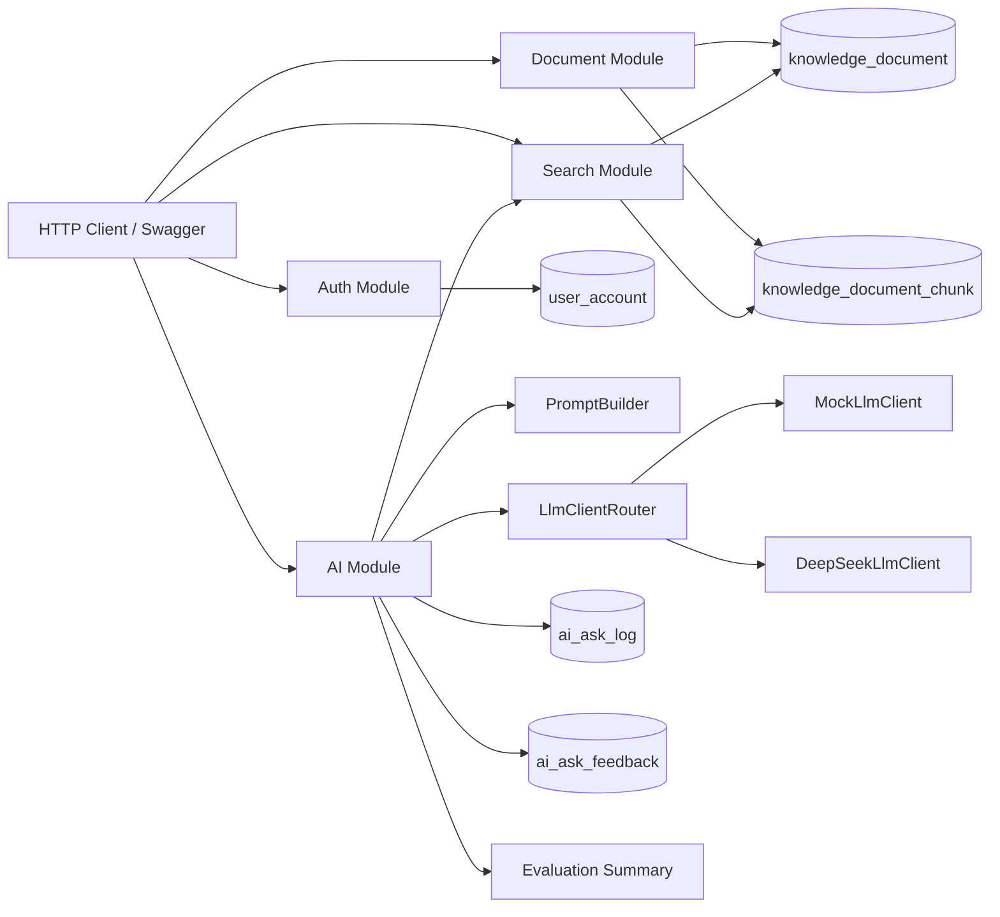
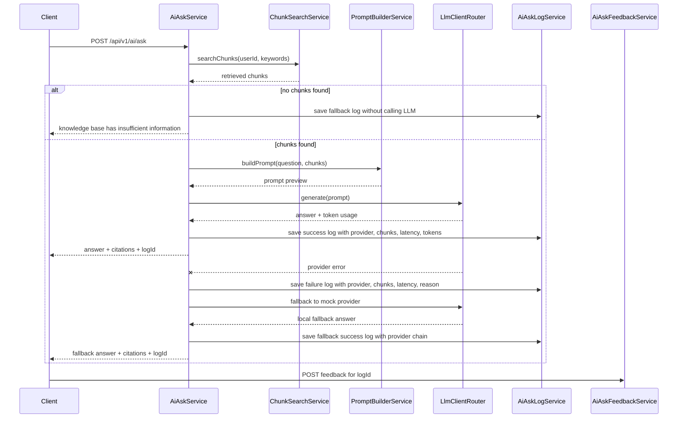

# DevMind Backend

DevMind is a Spring Boot backend for a personal developer knowledge base with a RAG-style AI question-answering pipeline.

It is built as a Java backend portfolio project, not a thin AI API wrapper. The project includes authentication, document management, chunk generation, retrieval, prompt building, LLM provider abstraction, citations, AI call logs, token usage tracking, bad-case feedback, and a lightweight RAG evaluation summary API.

## Why This Project

Many AI demos stop at "send a prompt to a model and return an answer". DevMind treats AI Q&A as part of a normal backend system:

```text
knowledge document
-> text or Markdown file import
-> document chunks
-> retrieval
-> no-context fallback when retrieval is empty
-> prompt building
-> LLM provider
-> provider fallback when the real model fails
-> answer with citations
-> success/failure ask log with token usage
-> bad-case feedback
-> evaluation summary
```

This makes the project easier to explain in Java backend interviews because the AI feature is connected to familiar backend concerns: authentication, database design, service layering, observability, cost tracking, and iterative quality improvement.

## Core Features

- JWT authentication with BCrypt password hashing
- Redis-backed JWT logout blacklist
- User-scoped knowledge documents
- Soft archive instead of physical deletion
- Text and Markdown note import with automatic document creation
- Automatic document chunk generation and rebuild on update
- Multilingual keyword retrieval for Chinese and English technical questions
- `RetrievalStrategy` abstraction with keyword baseline and hybrid retrieval strategy
- MySQL FULLTEXT relevance retrieval for chunk content
- `EmbeddingClient` abstraction with persisted local sparse-vector rerank for hybrid retrieval experiments
- Metadata-aware retrieval across chunk content, document title, tags, and source type
- Duplicate chunk downranking to reduce repeated citations from copied notes
- No-context fallback to avoid unsupported model answers
- RAG ask flow with prompt preview and citations
- Pluggable LLM layer with `MockLlmClient` and `DeepSeekLlmClient`
- DeepSeek real-model integration through environment variables
- Provider fallback from the configured real model to local mock when the model call fails
- AI ask logs with success/failure status, provider, latency, retrieved chunk ids, and token usage
- AI feedback records for helpful labels and bad-case collection
- Evaluation summary API for total feedback, bad-case count, bad-case rate, and recent bad cases
- RAG evaluation dataset API for standard questions, expected answers, expected keywords, and ask-log coverage
- Retrieval evaluation metrics with Hit@3, MRR, first relevant rank, and no-context negative cases
- OpenAPI / Swagger UI and IDEA HTTP Client examples

## Tech Stack

```text
Java 17
Spring Boot 3.3.x
Spring Security
MyBatis-Plus
MySQL
Redis
Maven
Flyway
Springdoc OpenAPI
JJWT
DeepSeek API
```

## Testing And CI

Run the unit test suite locally:

```bash
mvn test
```

The current tests cover core logic that should stay stable during later iterations:

```text
Prompt building
Mock LLM responses
LLM provider routing
JWT creation and parsing
Redis-backed token blacklist
```

GitHub Actions runs the same Maven test command on every push and pull request to `main`.

## Architecture



More details: [Architecture](docs/architecture.md)

## RAG Flow



## API Overview

Swagger UI:

```text
http://localhost:8081/swagger-ui.html
```

IDEA HTTP Client examples:

```text
docs/api/devmind-api.http
```

Main endpoints:

```text
POST   /api/v1/auth/register
POST   /api/v1/auth/login
GET    /api/v1/auth/me
POST   /api/v1/auth/logout

POST   /api/v1/documents
POST   /api/v1/documents/import
GET    /api/v1/documents
GET    /api/v1/documents/{documentId}
PUT    /api/v1/documents/{documentId}
DELETE /api/v1/documents/{documentId}
GET    /api/v1/documents/{documentId}/chunks

GET    /api/v1/search/chunks
GET    /api/v1/search/chunks/by-ids

POST   /api/v1/ai/ask
GET    /api/v1/ai/ask-logs
POST   /api/v1/ai/ask-logs/{logId}/feedback
GET    /api/v1/ai/ask-feedback?helpful=&askLogId=
GET    /api/v1/ai/evaluation/summary
GET    /api/v1/ai/evaluation/dataset
```

## Observability And Evaluation

Each AI ask log records:

```text
question
retrieval keywords
prompt preview
model provider
mock or real-provider flag
retrieved chunk ids
elapsed milliseconds
prompt tokens
completion tokens
total tokens
status: success or failed
```

Logout writes the current JWT into a Redis blacklist with a TTL equal to the token's remaining lifetime. The authentication filter checks the blacklist before accepting a bearer token.

When retrieval returns no chunks, the backend returns a deterministic fallback answer instead of calling the LLM provider. This avoids unsupported answers and saves model tokens.

When retrieval has context but the configured real model fails, DevMind records a failed ask log first, then falls back to `MockLlmClient` and returns a local answer with the original citations. The response provider is stored as a provider chain such as `deepseek->mock-local`, so the UI and ask-log history can distinguish a normal real-model answer from a degraded answer.

Feedback records store:

```text
helpful label
bad-case reason
expected answer
related ask log id
```

The evaluation summary API aggregates:

```text
total feedback count
helpful count
bad-case count
bad-case rate
recent bad cases
```

The evaluation dataset API returns standard RAG test cases and marks whether the current user has already asked each question:

```text
case id
category
question
relevant document titles
expected keywords
expected answer
expected evidence
risk type
covered status
latest ask log id and retrieved chunk count
```

The retrieval evaluation API runs the same standard cases against the retrieval layer and judges relevance by manually labeled gold document titles. It reports pass rate, positive case count, Hit@K, MRR, first relevant rank, matched keywords, and missing keywords. Matched keywords are diagnostic only; they are not used as the relevance judge. Negative no-context cases are treated separately: they pass only when no chunk is retrieved.

## Retrieval Quality V1

The retrieval layer is exposed through a `RetrievalStrategy` interface, while vector representation is isolated behind an `EmbeddingClient` interface. DevMind currently uses `HybridRetrievalStrategy` as the primary strategy. It keeps the explainable keyword/FULLTEXT baseline, then adds a persisted local sparse-vector rerank so the same AI ask and evaluation flow can compare retrieval strategies without changing the rest of the system.

DevMind does not rely on a single raw keyword. The ask flow first resolves multiple retrieval keywords from the user question, including Chinese technical phrases and English tokens. Search then uses multiple candidate sources:

```text
MySQL FULLTEXT retrieval over chunk content
keyword LIKE fallback over chunk content
document metadata: title, tags, source type
Persisted local sparse-vector similarity over title, tags, and chunk content
```

Keyword scores are explainable:

```text
FULLTEXT relevance: capped BM25-style contribution
content match:     +10 per occurrence
title match:       +5 per occurrence
tags match:        +3 per occurrence
source type match: +1 per occurrence
```

MySQL InnoDB FULLTEXT provides a lightweight BM25-style relevance signal. DevMind combines that signal with the explicit keyword and metadata scores so the ranking is still easy to inspect during debugging.

The local sparse-vector rerank is intentionally deterministic: the current `EmbeddingClient` builds a normalized sparse vector from English tokens and Chinese bigrams, then uses cosine similarity as an additional ranking signal. Chunk vectors are generated when chunks are rebuilt and stored in `knowledge_document_chunk_vector`, so the query path only has to build the query vector and compare it with persisted chunk vectors. This is not a neural-network embedding model or production vector database yet; it is a measurable hybrid retrieval skeleton that can later swap the local sparse-vector implementation for a real embedding provider and vector store without rewriting the RAG orchestration.

After initial ranking, repeated chunk content is downranked in the keyword baseline. This prevents copied notes from occupying all top citations and gives the prompt more diverse context.

This is still a lightweight retrieval implementation. It is intentionally easy to explain in a Java backend interview, and the gold-label Hit@3/MRR evaluation API provides a baseline for future external embedding, vector database, and rerank upgrades.

## Document Import

The import API accepts `.txt`, `.md`, and `.markdown` files:

```text
POST /api/v1/documents/import
Content-Type: multipart/form-data
```

Supported form fields:

```text
file       required
title      optional, defaults to the file name
sourceType optional, defaults to imported_note
tags       optional
summary    optional
```

After import, the backend creates a normal knowledge document and rebuilds chunks through the same `DocumentChunkService` path used by manual document creation. This keeps the RAG pipeline consistent and makes uploaded notes immediately searchable.

## Local Setup

Requirements:

- JDK 17+
- Maven 3.8+
- MySQL 5.7+/8.0+
- IntelliJ IDEA 2024.1.2 or compatible

Create the database:

```sql
CREATE DATABASE IF NOT EXISTS devmind DEFAULT CHARACTER SET utf8mb4 COLLATE utf8mb4_unicode_ci;
```

Database tables are managed by Flyway migrations:

```text
src/main/resources/db/migration/
```

When the application starts, Flyway checks and applies pending migrations automatically.

For an existing local database that was created manually before Flyway was introduced, `baseline-on-migrate` is enabled so Flyway can take over the current schema safely.

Default app port:

```text
8081
```

Default database:

```text
devmind
```

## Environment Variables

Minimal local configuration:

```text
DEVMIND_DB_URL=jdbc:mysql://localhost:3306/devmind?useUnicode=true&characterEncoding=utf8&useSSL=false&serverTimezone=Asia/Shanghai&allowPublicKeyRetrieval=true
DEVMIND_DB_USERNAME=your_mysql_username
DEVMIND_DB_PASSWORD=your_mysql_password
DEVMIND_JWT_SECRET=replace_with_a_long_random_secret_for_non_local_use
DEVMIND_AI_PROVIDER=mock
DEVMIND_REDIS_HOST=localhost
DEVMIND_REDIS_PORT=6379
DEVMIND_REDIS_DATABASE=1
```

DeepSeek provider:

```text
DEVMIND_AI_PROVIDER=deepseek
DEVMIND_DEEPSEEK_API_KEY=your_api_key
DEVMIND_DEEPSEEK_BASE_URL=https://api.deepseek.com
DEVMIND_DEEPSEEK_MODEL=deepseek-v4-flash
DEVMIND_DEEPSEEK_TEMPERATURE=0.2
```

Never commit real API keys.

The default JWT secret in `application.yml` is only for local development. Override `DEVMIND_JWT_SECRET` in any shared, deployed, or production-like environment.

## Learning Notes

Personal interview preparation notes are kept outside this public repository.
