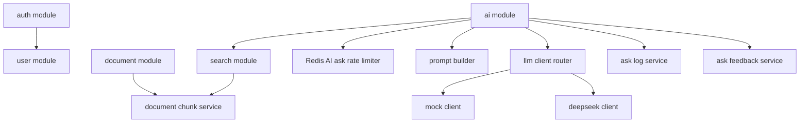
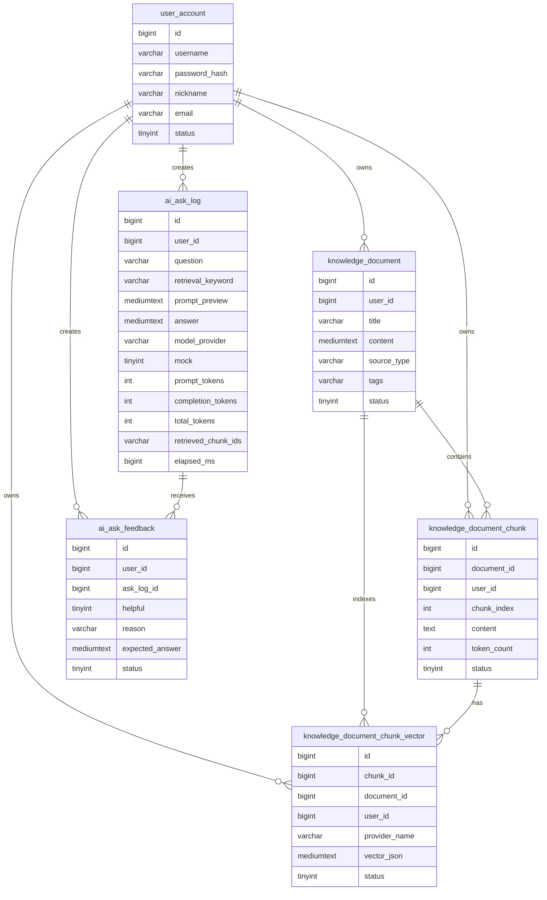
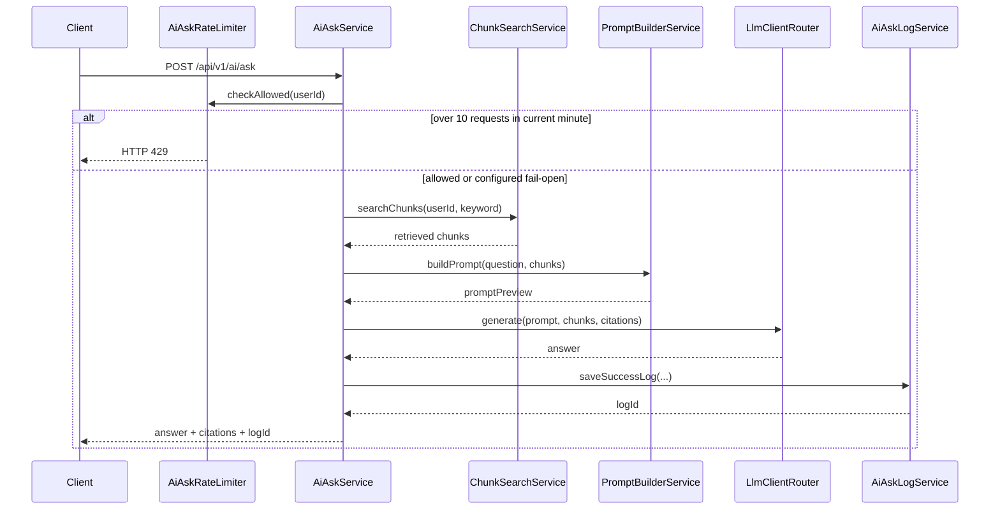

# DevMind 架构

## 目标

DevMind 是一个个人开发者知识库的 Java 后端项目。系统存储学习笔记和项目复盘，把长文档切成 chunk，检索相关 chunk，构造 RAG Prompt，并通过可插拔的 LLM client 路由最终的答案生成。

## 模块总览

## 数据模型

## RAG 流程

## 设计取舍

- 文档和 chunk 用软归档而非物理删除，保留历史。
- 文档更新后重建 chunk，保证检索结果和最新内容对齐。
- 检索用 `RetrievalStrategy`、`EmbeddingClient`、`RerankClient` 三层抽象，让关键词、稀疏向量、dense embedding 和 rerank 策略共用同一套问答与评估流程。
- `EmbeddingClient` 把向量表示和检索编排分离：本地确定性稀疏向量（默认、零外部成本）和可选的真实 dense embedding（OpenAI 兼容 API）按 `provider_name` 共存于同一张向量表，可由配置切换。
- `RerankClient` 隔离 rerank 供应商（默认 `none`，可选外部 `/rerank` API），用于离线五方评估中的精排策略。
- chunk 向量行随文档 chunk 一起重建，存入 `knowledge_document_chunk_vector`。问答路径只构造 query 向量，再与已持久化的 chunk 向量比较，而不是每次提问都重算全部 chunk 向量。
- chunk 内容的 FULLTEXT 索引使用 ngram parser，让中文查询直接走 FULLTEXT 相关性排序；SQL 侧只做宽候选池截断（LIKE 兜底按更新时间截取），真正的相关性打分在服务层完成。
- 向量通道默认对持久化向量做暴力余弦，扫描上限为固定常量；启用 pgvector 后 dense 向量的相似度查询改由 Postgres HNSW 索引承担，不再受该上限约束。
- 双库取舍：MySQL 始终是主数据的唯一事实来源，向量是可由源文本重建的派生数据。启用 pgvector 时 dense 向量双写（MySQL JSON 行为源，pg 为 serving 索引），pg 写入是 best-effort——失败只降低召回、绝不阻塞主流程，脏行在读取侧被主库校验兜底。backfill 会把已有 active dense JSON 直接重放到 pgvector，也会生成缺失或复活归档的 MySQL 向量行。
- pgvector 的 HNSW 索引对 vector 类型最多支持 2000 维，因此 dense embedding 通过 API 的 dimensions 参数请求 1024 维，启动时对超限维度 fail-fast。
- 混合检索用 RRF 融合关键词/FULLTEXT 排名和向量排名，避免直接相加不同量纲的分数。
- `LlmClient` 把模型供应商实现和 RAG 编排分离。
- AI 问答入口按登录用户做固定一分钟窗口限流。Redis Lua 将 `INCR` 与首次 `EXPIRE` 放在同一次原子执行中，避免并发下计数与 TTL 分离；默认阈值为 10 次/分钟，超限返回 HTTP 429。Redis 故障时可在 fail-open（可用性优先）和 fail-closed（保护能力优先）之间配置。
- 调用日志记录问题、检索关键词、chunk id、答案、provider、token 用量和耗时，供后续 bad case 分析。
- 反馈记录保存 helpful 标注、原因和期望答案，让 bad case 能沉淀成一个小型评估数据集。
- 评估汇总接口聚合反馈数、bad case 数、bad case 率和近期 bad case，用于 RAG 质量分析。
- Flyway 管理数据库 schema 版本，让本地初始化和后续迁移不依赖手动复制 SQL。

## 后续改进

- 无上下文判定目前基于“召回为空”。本地稀疏 bigram 表示下，改写正例与 hard-negative 的相似度会倒挂（实测约 0.14 vs 0.16），不存在可分阈值；计划改为基于 dense 相似度阈值或 rerank 分数做判定。
- HNSW 参数（m、ef_construction、ef_search）目前使用 pgvector 默认值；在更大语料上应按"召回损失 vs 查询延迟"的实测曲线调优，并把 ef_search 暴露为运行时配置。

- 把 rerank 从离线评估接入线上问答链路（配合成本/延迟控制），而不只是评估用。
- 扩大 gold-label 评估集，让 Hit@3/MRR 对比从“方向性”变为“统计显著”。
- 把向量回填接口做到可用于生产（权限范围、限流、异步任务、成本控制）。
- 引入语义分块，替代固定长度加重叠的分块。
