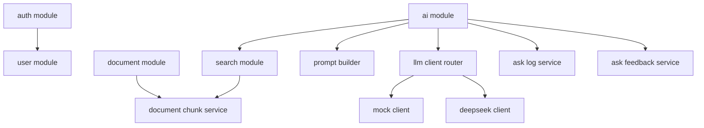
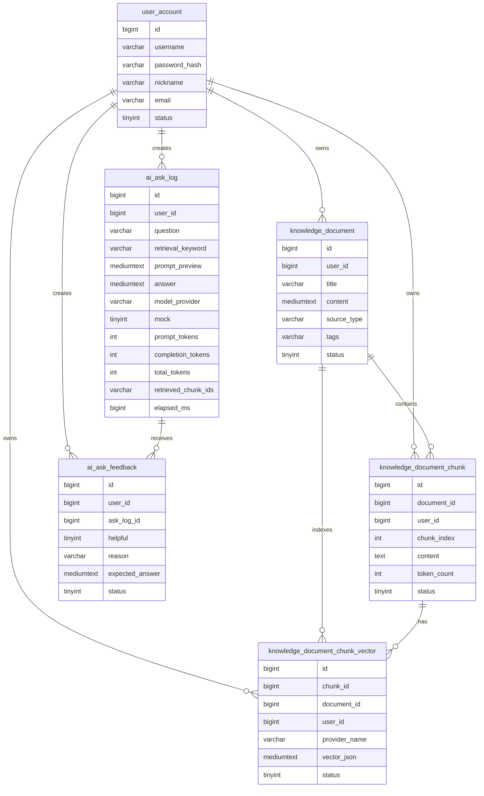
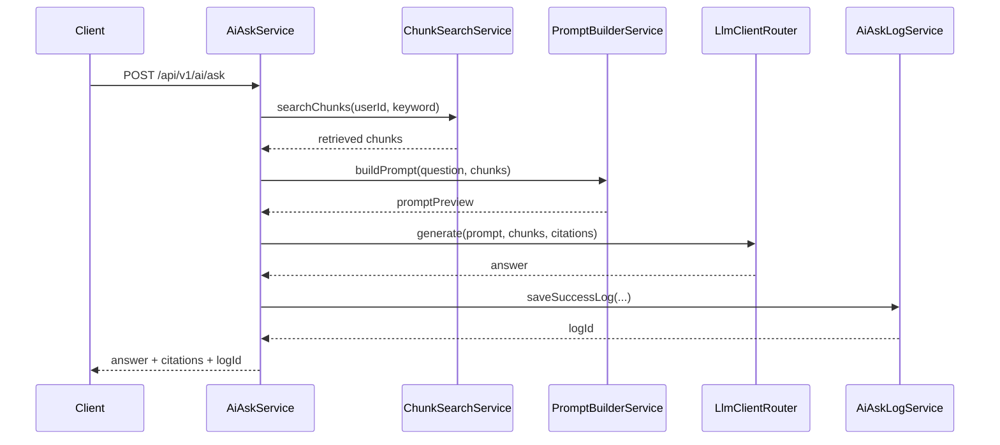

# DevMind Architecture

## Goal

DevMind is a Java backend project for a personal developer knowledge base. The system stores learning notes and project reviews, turns long documents into chunks, retrieves relevant chunks, builds a RAG prompt, and routes the final answer generation through a pluggable LLM client.

## Module Overview

## Data Model

## RAG Flow

## Design Choices

- Soft archive is used for documents and chunks to preserve history.
- Chunks are rebuilt after document updates to keep retrieval results aligned with the latest content.
- Retrieval uses `RetrievalStrategy`, `EmbeddingClient`, and `RerankClient` abstractions so keyword, sparse-vector, dense-embedding, and rerank strategies share the same ask and evaluation flow.
- `EmbeddingClient` separates vector representation from retrieval orchestration: a local deterministic sparse vector (default, zero external cost) and an optional real dense embedding (OpenAI-compatible API) coexist by `provider_name` in the same vector table and can be switched by configuration.
- `RerankClient` isolates the rerank provider (default `none`, optional external `/rerank` API), used in the offline four-way evaluation.
- Chunk vector rows are rebuilt together with document chunks and stored in `knowledge_document_chunk_vector`. The ask path builds only the query vector, then compares it with persisted chunk vectors instead of recomputing every chunk vector on each question.
- Hybrid retrieval uses RRF to fuse keyword/FULLTEXT ranking with vector ranking, avoiding direct addition of scores with different scales.
- `LlmClient` separates model-provider implementation from RAG orchestration.
- Ask logs record question, retrieval keyword, chunk ids, answer, provider, token usage, and elapsed time for later bad-case analysis.
- Ask feedback stores helpfulness labels, reasons, and expected answers so bad cases can become a small evaluation dataset.
- The evaluation summary endpoint aggregates feedback count, bad-case count, bad-case rate, and recent bad cases for RAG quality analysis.
- Flyway manages database schema versioning so local setup and future migrations do not depend on manual SQL copy-paste.

## Next Improvements

- Migrate vector storage from MySQL JSON to a real vector database (e.g. pgvector) for ANN-scale retrieval.
- Wire rerank from offline evaluation into the online ask path (with cost/latency controls), instead of evaluation only.
- Enlarge the gold-label evaluation set so the Hit@3/MRR comparison becomes statistically significant rather than directional.
- Harden the vector backfill endpoint for production use (authorization scope, rate limiting, async job, cost control).
- Add semantic chunking instead of fixed-length overlap chunking.
